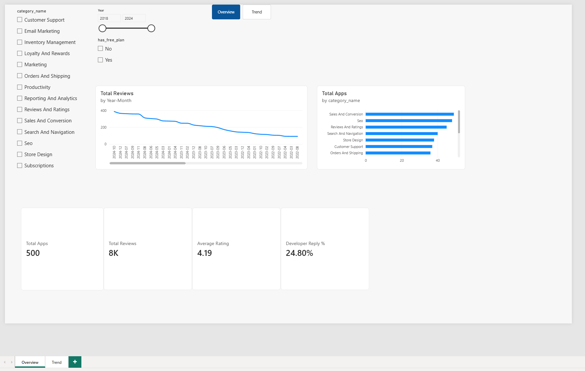
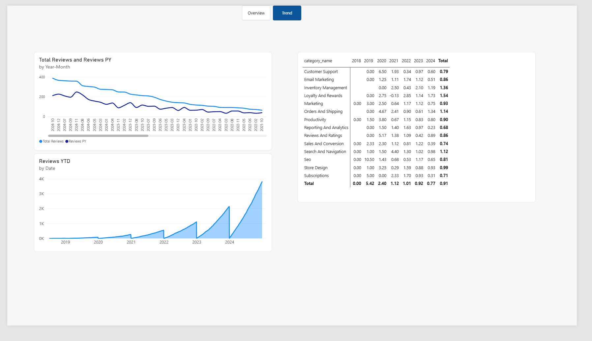
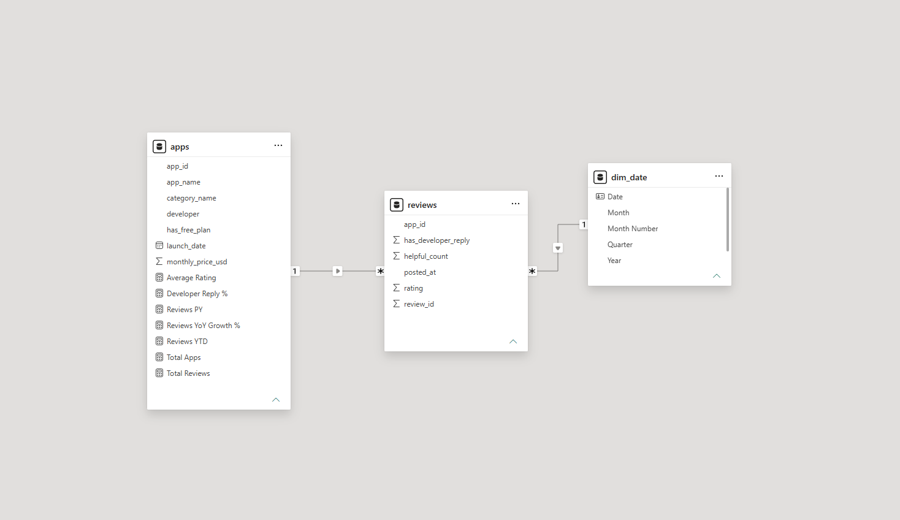

# Shopify App Store Analysis

## Executive Summary
This Power BI project provides an end-to-end analytical framework for evaluating app performance, merchant review volume, developer responsiveness, and rating distributions across the Shopify App Store ecosystem. Key insights focus on identifying high-growth app categories, tracks YoY review volume expansion, and evaluates the relationship between developer responsiveness and user satisfaction metrics.

## Data Model Architecture
The reporting model utilizes a star schema design optimized for time intelligence and dynamic slicing:

* **`apps` (Dimension Table):** Contains app attributes, category mappings, pricing tiers, and developer identifiers.
* **`reviews` (Fact Table):** Houses granular review logs, numerical ratings, helpful counts, and developer response tracking.
* **`dim_date` (Date Dimension):** Generated via DAX CALENDAR logic to support standardized Year, Quarter, Month, and YoY calculations.

**Relationships:**
* `apps[app_id]` (1) ─── (*) `reviews[app_id]`
* `dim_date[Date]` (1) ─── (*) `reviews[posted_at]`

## Key DAX Measures & Calculations

* **Total Apps:** `COUNTROWS(apps)`
* **Total Reviews:** `COUNTROWS(reviews)`
* **Average Rating:** `AVERAGE(reviews[rating])`
* **Developer Reply %:** `DIVIDE(SUM(reviews[has_developer_reply]), COUNT(reviews[review_id]), 0)`
* **Reviews Prior Year (PY):** `CALCULATE([Total Reviews], SAMEPERIODLASTYEAR(dim_date[Date]))`
* **Reviews YoY Growth %:** `DIVIDE([Total Reviews] - [Reviews PY], [Reviews PY], 0)`
* **Reviews YTD:** `TOTALYTD([Total Reviews], dim_date[Date])`

## Visualizations Overview

### Page 1: Overview
* **KPI Header Cards:** High-level metrics tracking overall marketplace scale and developer engagement.
* **Category Breakdown:** Horizontal bar chart comparing app distribution across market categories.
* **Review Trends:** Historical volume tracking over custom date ranges.
* **Interactive Filtering:** Left-hand slicers enabling real-time filtering by category, year, and free plan availability.

### Page 2: Trend Analysis
* **YoY Performance Tracking:** Line visual comparing current review metrics against Prior Year values.
* **Year-to-Date Accumulation:** Area visual illustrating cumulative review growth patterns over annual cycles.
* **Category Performance Matrix:** Comparative table breaking down category performance and growth percentages.

### Model View

## Maintenance & Extension Guide
* **Data Refresh Procedure:** Ensure new incoming `reviews.csv` entries adhere to standard ISO date formats (`YYYY-MM-DD`). Replace files in the `/data` directory and trigger a model refresh in Power BI Desktop.
* **Adding Custom Metrics:** Extended developer engagement KPIs (e.g., average time-to-reply) can be incorporated into the fact table by adding timestamp differentials in Power Query.
